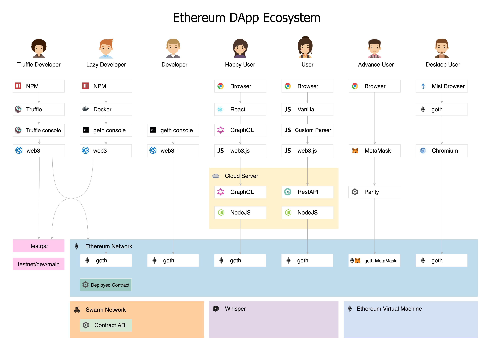

# Blockchain Smart Contract & IPFS - Boilerplate
This helpful Boilerplates that allow you to focus on what makes your DApp unique; includes Solidity Smart Contracts &amp; Libraries, Front-end Views and more.

[](https://www.npmjs.com/package/o2oprotocol)
[](https://travis-ci.org/o2oprotocol/o2oprotocol)


## 1. Roadmap

### 1.1. Truffle Developer
- [x] O2OProtocol Initial - `User Registry` Smart Contract
- [x] Development & Deployment Environment: local,ropsten,rinkeby,mainnet
- [x] Standard [EIP-20: ERC-20 Token Standard](https://github.com/ethereum/EIPs/blob/master/EIPS/eip-20.md). TODO: [ERC-233](https://github.com/ethereum/EIPs/issues/223)
- [x] Coding best practices: safeMath
- [x] Design Pattern: `Owned`, `Controller`, `Access Controll`, `Database`, `Ledger`, `Oraclize`
- [x] Design Pattern: `New Policy`, `Underwrite`, `Payout`
- [x] Design Pattern `Sharing Economy`: `Listing`, `Purchase` 
- [ ] IPFS
- [ ] [Web3](https://github.com/ethereum/wiki/wiki/JavaScript-API#web3ethestimategas) and [JSON RPC](https://github.com/ethereum/wiki/wiki/JSON-RPC#eth_estimategas)
- [ ] O2O High-Level Architecture
- [ ] The ABI definition of the Smart Contract: "public" via etherscan + "private" via frontend.
- [ ] Testing using [Ganache (TestRPC)](https://github.com/trufflesuite/ganache-cli)

## 1.2. Lazy Developer
- [ ] Private Blockchains “Consortium Blockchains” using [Geth](https://www.ethereum.org/cli) to setup a “private” or “testnet” Ethereum blockchain. Note: Geth is suitable for building frontends for DApps --> Genesis block, Indentity, DataDir --> Externally Owned Accounts `EOA` & `Contract Accounts`
[TODO](https://coin5s.com/content/deploying-dapp-ethereum%E2%80%99s-test-blockchain)
- [ ] Develop eConomySharing: `Listing.sol`
- [ ] Financial atomic processes & standards: payments, assets, data, identity, KYC, governance


## 1.3. Happy User

## 2. O2OProtocol Initial



### Smart Contract Packages:
npm install --save truffle web3 dotenv uport-connect ipfs-api truffle-hdwallet-provider
npm install --save-dev ganache-cli solium solidity-coverage

### Frontend Packages:
npm install --save react react-dom redux react-redux react-router redux-thunk
npm install --save-dev

@TODO
`npx` explain: https://goo.gl/gsgYNR
make sure `npm` version >= 5.2.0


### Directory Structure

```
/
├── contracts                                           <- Directory for Solidity contracts 
│   ├── Migrations.sol
│   └── UserRegistry.sol
├── migrations                                          <- Directory for scriptable deployment files 
│   ├── 1_initial_migration.js
│   └── 2_deploy_contracts.js
├── test                                                <- Directory for test files for testing your application and contracts
│   └── TestUserRegistry.js
├── truffle-config.js                                   <- Truffle configuration file
```

## 3. Testing

### Test on Local blockchain

In terminal
```
npx truffle develop
```
and then at prompt type:
```
test
```

To show the gas costs of each transaction during a test, set the enviroment variable `GAS_TRACKING` before launching `truffle develop`. For example, using bash: `GAS_TRACKING=1 npx truffle develop`.

### Rinkeby, Ropsten, Main, and other blockchains
We deploy contracts through [Infura](https://infura.io/) to reduce time on `syncing` node with chain on local machine

Please provide follow key before run
```
INFURA_ACCESS_TOKEN
GAS_LIMIT
ROPSTEN_MNEMONIC or
RINKEBY_MNEMONIC or
MAINNET_MNEMONIC 
```

```
export ROPSTEN_MNEMONIC=[MNEMONIC] &&
export INFURA_ACCESS_TOKEN=[KEY]   &&
export GAS_LIMIT=[GAS]             &&
npx truffle test
```

## Troubleshooting

If you get the following error:

```
Error: Attempting to run transaction which calls a contract function, but recipient address 0x8cdaf0cd259887258bc23a92c0a6da92698644c0 is not a contract address
```

Resolve this by running all migrations again:

```sh
migrate --reset
```

## Publish

```sh
npm publish &&

```

### 1.1.1. Smart Contract 


### 1.1.2. Data Sharing

> Sellers:

 - Create Listings
 - Update Listings
 - Delete Listings
 - Validate Listings
 
> Buyers:
 
 - Browse Listing
 - Create Bookings
 - Update Bookings
 - Cancel Bookings

 Note: to show the gas costs of each transaction during a test, set the enviroment variable GAS_TRACKING before launching truffle develop. For example, using bash: GAS_TRACKING=1 npx truffle develop